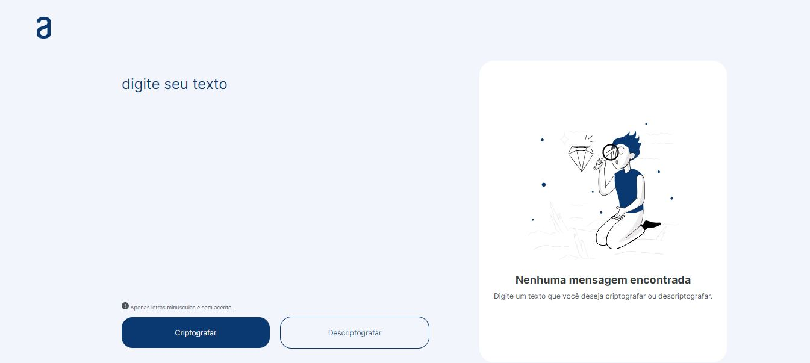

<h1 align="center">Challenge Decodificador</h1>

<h2>🔖 Sobre</h2>

Desafio <b>Decodificador de Texto</b> realizado para a Formação Iniciante em Programação do Programa ONE da Oracle + Alura.

<h2>📃 Descrição</h2>

O Decodificador de Texto 🔍 é uma aplicação que criptografa textos, para trocar mensagens secretas com outras pessoas que saibam o segredo da criptografia utilizada.

🔑 As "chaves" de criptografia utilizadas são:
<ul>
  <li>A letra "e" é convertida para "enter"
  <li>A letra "i" é convertida para "imes"
  <li>A letra "a" é convertida para "ai"
  <li>A letra "o" é convertida para "ober"
  <li>A letra "u" é convertida para "ufat"
</ul>

🚨 Requisitos:
* Deve funcionar apenas com letras minúsculas
* Não devem ser utilizados letras com acentos nem caracteres especiais
* Deve ser possível converter uma palavra para a versão criptografada e também retornar uma palavra criptografada para a versão original. Por exemplo: "gato" => "gaitober" "gaitober" => "gato"
* A página deve ter campos para inserção do texto a ser criptografado ou descriptografado, e a pessoa usuária deve poder escolher entre as duas opções
* O resultado deve ser exibido na tela

✅ Extra:
* Um botão que copie o texto criptografado/descriptografado para a área de transferência - ou seja, que tenha a mesma funcionalidade do ctrl+C ou da opção "copiar" do menu dos aplicativos.

## 🚀 Tecnologias

  
  
  

## 💻 Interface

## 🌟 Feito por:

### <a href="https://github.com/ketijor">Keti Jorgensen</a>

